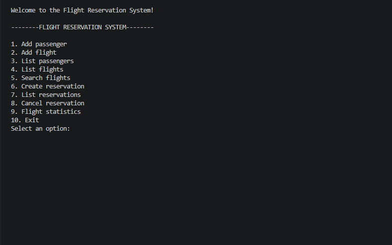
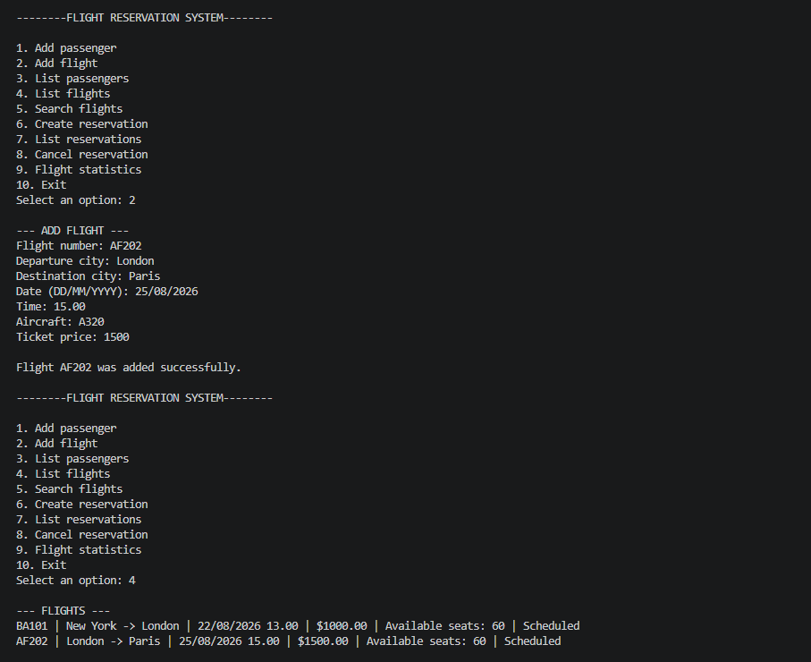
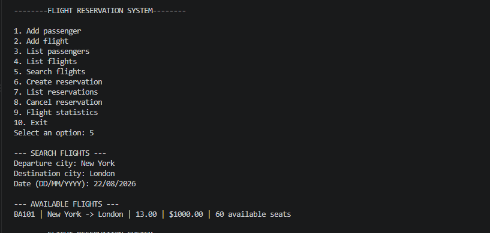
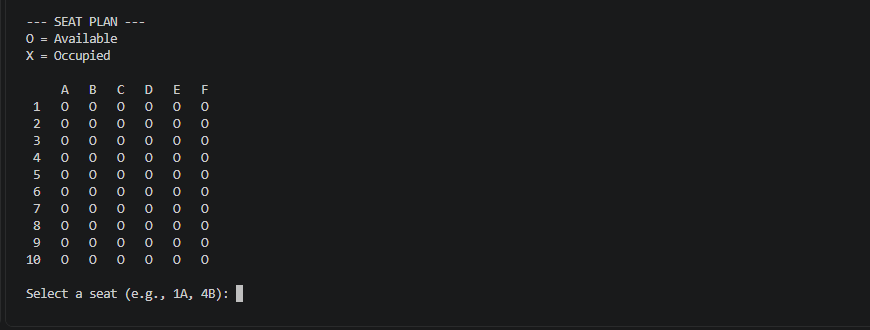
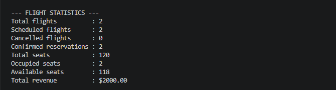

# Flight Reservation System in Python

A console-based Flight Reservation System developed in Python.

This project was created to reinforce my Python programming and object-oriented programming skills through practical development.

The system provides separate classes for passengers, flights, reservations, data storage, and airline management. It allows users to manage passengers and flights, search for scheduled flights, create and cancel reservations, manage seats, and view flight statistics.

## Features

* Add and list passengers
* Add and list flights
* Search scheduled flights
* Create flight reservations
* Display seat availability
* Prevent duplicate reservations for the same passenger and flight
* Prevent reserving occupied seats
* Cancel reservations and release seats
* Display active reservations
* Display flight statistics and total revenue
* Save and load application data
* Handle invalid input and file errors

## Technologies Used

* Python
* Object-Oriented Programming (OOP)
* Classes and Objects
* Encapsulation
* Class Methods
* Lists and Dictionaries
* JSON File Handling
* Exception Handling
* VS Code

## Project Structure

```text
Airline-Reservation-System-in-Python/
├── README.md
├── LICENSE
├── .gitignore
├── AirlineReservationSystem/
│   ├── main.py
│   ├── passenger.py
│   ├── flight.py
│   ├── reservation.py
│   ├── storage.py
│   └── airline_manager.py
└── screenshots/
    ├── main-menu.png
    ├── passenger-management.png
    ├── flight-management.png
    ├── flight-search.png
    ├── seat-selection.png
    ├── reservation-management.png
    └── flight-statistics.png
```

## How to Run

Open the project in **VS Code** or another Python-compatible IDE and run `main.py`.

## Screenshots

### Main Menu



### Passenger Management


### Flight Management



### Flight Search



### Seat Selection



### Reservation Management


### Flight Statistics



## Related Learning

I completed the **Programming in Python** course offered by **Meta** on Coursera.

After completing the course, I developed this project to reinforce the Python programming and object-oriented programming concepts I learned throughout the course.

**Coursera Certificate:**
[View Certificate](https://coursera.org/verify/ZRZTLBFWFMQ3)

## Author

Silva Ibrahim

Computer Engineering Student

## License

This project is licensed under the MIT License.
